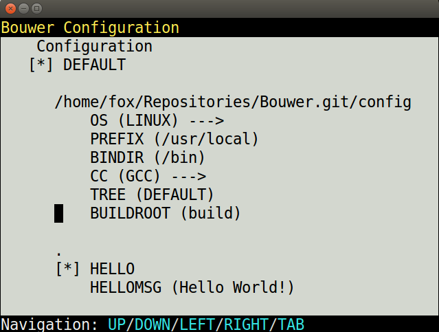

Bouwer Tutorial
================

This page gives a introduction how to use bouwer for simple C/C++ development. Make sure you have bouwer installed on
your system:

.. code-block:: bash

  $ git clone https://github.com/nieklinnenbank/bouwer

If you want to invoke bouwer by simply calling ``bouw`` on the commandline, make an alias in ``bash``:

.. code-block:: bash

  $ alias bouw=/path/to/bouwer.git/bouw

To view all available

Hello World
-----------

First we make a hello world C program. Open your favorite text editor and create the file ``hello.c``:

.. literalinclude:: hello.c
   :language: c
   :linenos:

To build a C program using Bouwer, you must create a ``Bouwfile`` which describes how to build it. Create
a file called ``Bouwfile`` in the same directory as the ``hello.c`` file:

.. code-block:: python
   :linenos:

   def build(conf):
       Program('hello.c')

Now you need to run Bouwer to let it read the ``Bouwfile`` and compile the Hello world program. Type
the following command on your terminal:

.. code-block:: bash

   $ bouw
       CC  hello.o
     LINK  hello

The hello world program is now compiled! Run it to test:

.. code-block:: bash

   $ ./hello
   Hello world!

If you run bouwer again, you will see it will not re-compile the Hello world program, until you actually change the source code:

.. code-block:: bash

   $ bouw
   $ touch hello.c
   $ bouw
       CC  hello.o
     LINK  hello

Adding configuration
--------------------

To make the hello world configurable, you must add configuration items in a ``Bouwconfig`` file.
Create the ``Bouwconfig`` file with the following contents:

.. literalinclude:: Bouwconfig
   :language: python

The ``Bouwconfig`` specifies a configuration item ``HELLO`` and ``HELLOMSG``. The ``HELLO`` item is a boolean and determines if the
hello world program should be build. The ``HELLOMSG`` is a string with the message to print from the hello world program.

To let the hello world program use the ``HELLOMSG`` you need to generate a C configuration header ``config.h`` from the current configuration.
You can use the builder ``ConfigHeader`` to generate it. Change your ``Bouwfile`` to the following:

.. literalinclude:: Bouwfile
   :language: python

Change the hello world program to include the ``config.h`` file, so that it can insert the ``HELLOMSG`` to the ``printf()`` line:

.. literalinclude:: hello2.c
   :language: c

Now compile the hello world program and see it work:

.. code-block:: bash

   $ bouw
       GEN  config.h
        CC  hello.o
      LINK  hello
   $ ./hello
   This is the Hello World program!

Changing configuration
----------------------

To change the configuration for the hello world program, you can use the MenuConfig graphical configuration editor. Simply
start bouwer with the ``--menuconfig`` commandline argument to change the configuration:

.. code-block:: bash

   $ bouw --menuconfig

In the graphical interface, press the UP, DOWN keys to navigate. Press ENTER to change a configuration item. For example, you can
change the ``HELLOMSG`` by using the UP & DOWN keys to select it, then press ENTER and type a new message. Press TAB to select the OK button. Then press ENTER to press it.
You can also change other settings, such as the compiler (``CC``) or the build directory (``BUILDROOT``). After changes, press Q to quit and save the configuration.
Then (re)compile the hello world program to apply your changes to the program:

.. code-block:: bash

   $ bouw
       GEN  config.h
        CC  hello.o
      LINK  hello
   $ ./hello
   My changed hello world message

Adding build targets
--------------------
You can add more build targets in a ``Bouwfile``. By default bouwer execute the build target ``build``. For example, you can
add a build target ``dist`` and ``uname`` to the hello world project:

.. code-block:: python

   def build(conf):
       """
       Build the hello world program
       """
       ConfigHeader('config.h')
       Program(conf.HELLO, 'hello.c')

   def dist(conf):
       Archive('hello.tar.gz', exclude=['hello', 'config.h'])

   def uname(conf):
       Command('uname -a')

Now you can run the build targets simply by passing them as a parameter to the ``bouw`` program:

.. code-block:: bash

   $ bouw
        CC  hello.o
      LINK  hello
   $ bouw dist
       TAR  hello.tar.gz
   $ bouw uname
   Linux nemesis 3.13.0-32-generic #57-Ubuntu SMP Tue Jul 15 03:51:08 UTC 2014 x86_64 x86_64 x86_64 GNU/Linux

Customizing build output
---------------------
It is possible to output the build progress in various ways. By default bouwer outputs the build status in pretty output mode (``--pretty``).
Bouwer also supports a progress bar (``-p`` / ``--progress``), full command output (``--full``) and quiet mode (``-q``, ``--quiet``).
See the bouwer commandline help for more information about the bouwer commandline arguments:

.. code-block:: bash

   $ bouw --help

Prebuild Compiler checks
------------------------
You can let various system checks run before the build using Autoconf-a-like checks. For example the following ``Bouwfile`` does
header, library and function checks for the hello world program.

.. literalinclude:: Bouwfile.Check
  :language: python

Linking with a library
----------------------
See the library demo in the ``demo/c/library`` directory of the bouwer source code on how to link with libraries.

Separating into Subdirectories
------------------------------
See the library demo in the ``demo/c/library`` directory of the bouwer source code on how to separate your project into directories.

Installing files
----------------

To install files, simply invoke the ``Install()`` builder. For example, the ``nano`` example project can install ``nano`` using the following build target in the ``Bouwfile``:

.. code-block:: bash

   def install(conf):
       Install(conf.BINDIR, ['src/nano'])

Creating a source archive (.tar.gz)
-----------------------------------

.. code-block:: bash

   def dist(conf):
       Archive('hello.tar.gz', exclude=['hello', 'config.h'])

Adding configuration trees (debug/release)
------------------------------------------

See the configuration trees examples in the ``demo/c/trees`` directory in the bouwer source code.
